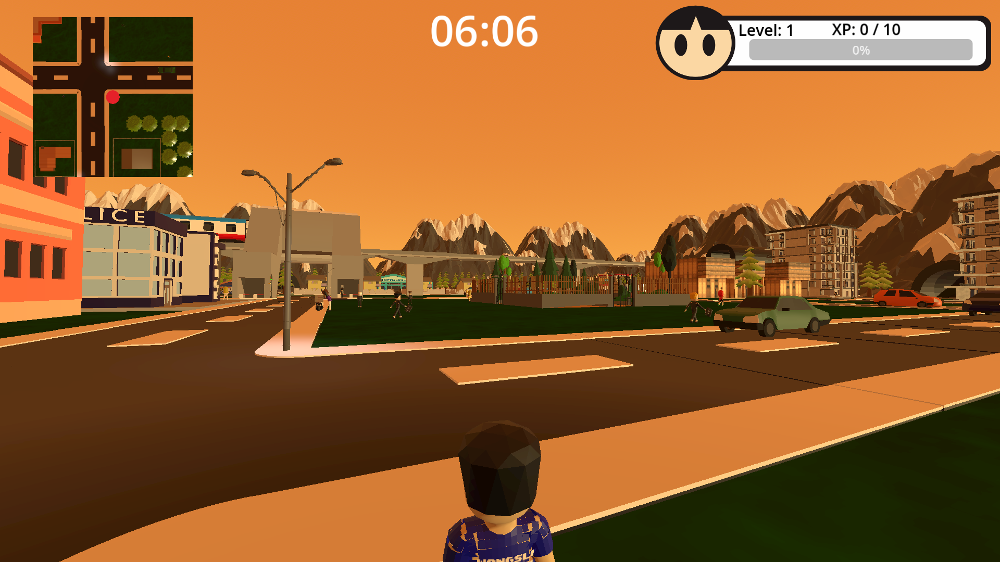
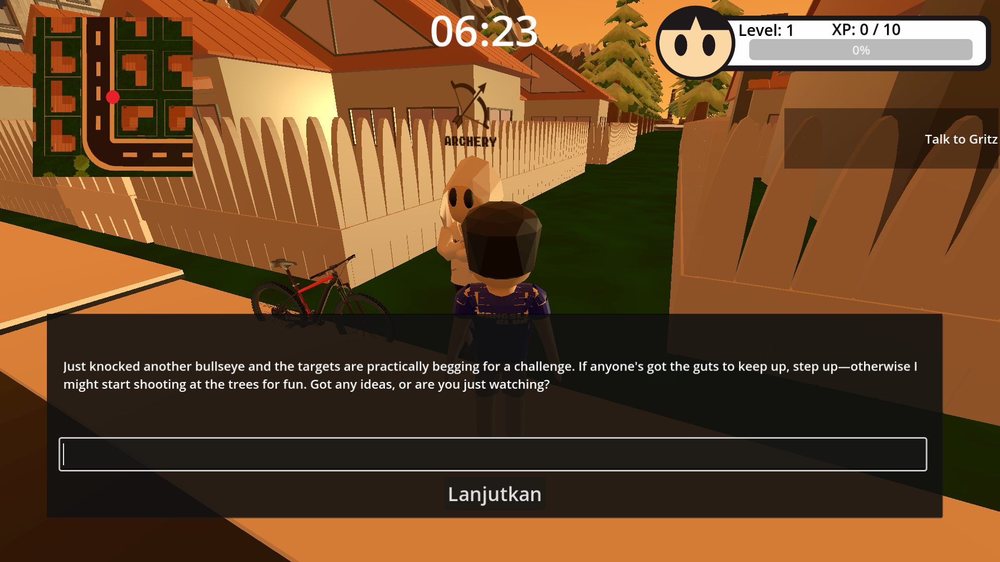
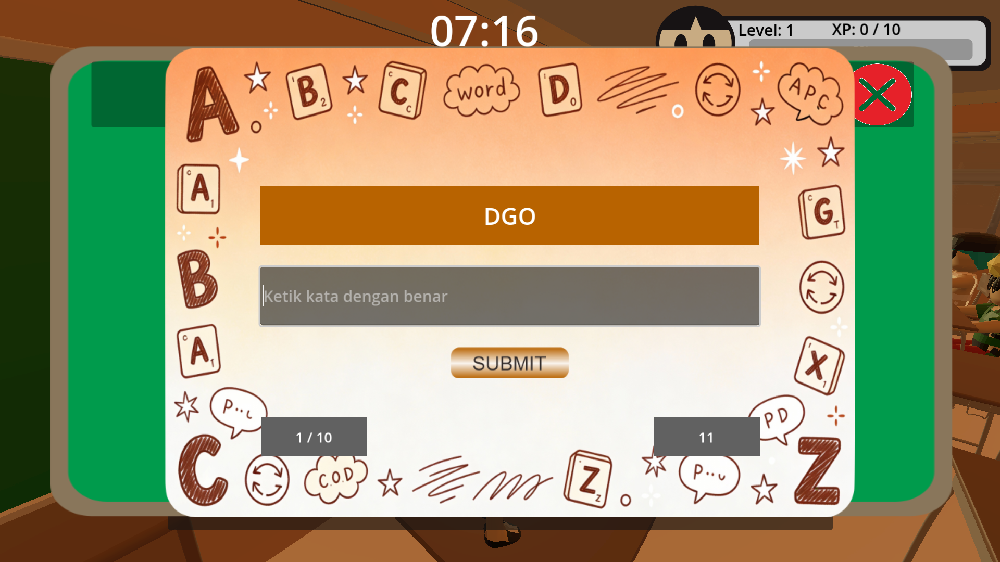
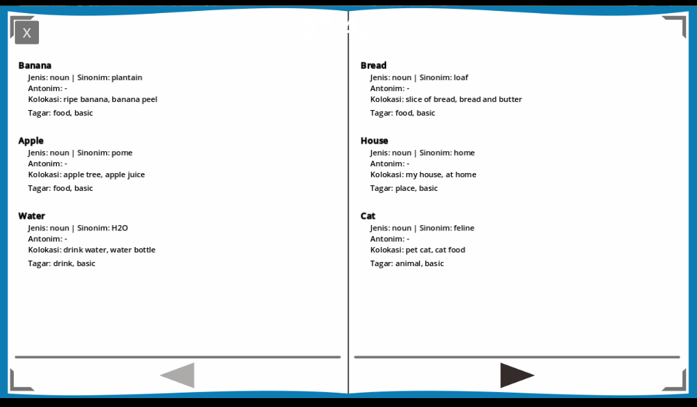
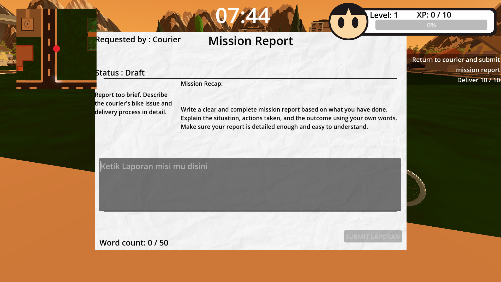
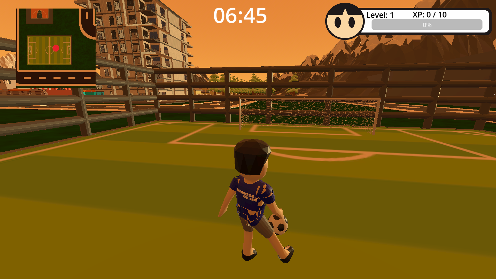

# 🎮 SMARTVOC

### An Open-World 3D Educational RPG for Interactive English Vocabulary Learning

<p align="center">

**Learn English by Playing, Exploring, and Experiencing.**

</p>

SMARTVOC is a **3D educational RPG** that integrates **English vocabulary learning with open-world exploration, interactive missions, mini-games, daily-life activities, and NPC interaction**.

Rather than relying primarily on memorization, SMARTVOC turns vocabulary learning into an interactive gameplay experience where players can **explore, interact, complete activities, discover new vocabulary, and practice English through gameplay**.

> 🎓 **An educational game designed to make English vocabulary learning part of the gameplay experience.**

---

## 📸 Project Showcase

<!-- IMAGE 1 — HERO / MAIN GAMEPLAY SCREENSHOT
Recommended: your best wide screenshot showing the open world + player character.
Recommended size: 1280×720 or 1920×1080.
-->

<p align="center">
  
</p>

<p align="center">
  <i>SMARTVOC open-world gameplay environment</i>
</p>

---

## 📌 Project Overview

|                  |                              |
| ---------------- | ---------------------------- |
| **Project**      | SMARTVOC                     |
| **Genre**        | Educational RPG / Open-World |
| **Platform**     | PC / Laptop                  |
| **Mode**         | Singleplayer                 |
| **Target Users** | University Students          |
| **Focus**        | English Vocabulary Learning  |
| **Engine**       | Godot Engine                 |
| **3D Tools**     | Blender                      |
| **Status**       | Playable Prototype           |

SMARTVOC was developed as an interactive learning experience for university students. The game combines educational activities with a 3D open-world environment so that learning can happen naturally through exploration and interaction.

---

# 🎯 Learning Concept

SMARTVOC integrates vocabulary learning directly into gameplay.

Instead of separating **learning** and **playing**, the game connects them through a progression system:

```text
        EXPLORE
           ↓
      INTERACT WITH NPC
           ↓
    DISCOVER ACTIVITIES
           ↓
    COMPLETE MISSIONS
           ↓
    LEARN NEW VOCABULARY
           ↓
    COMPLETE CHALLENGES
           ↓
     REVIEW IN DICTIONARY
           ↓
       CONTINUE PLAYING
```

The goal is to make vocabulary acquisition feel like part of the player's journey rather than a separate memorization task.

---

# 🌍 Open-World Exploration

Players can freely explore the game environment and discover different activities, NPCs, missions, and learning content.

### Exploration includes:

* 🗺️ Open-world environment
* 🧑 NPC interaction
* 🎯 Missions and activities
* 🔍 Discoverable learning content
* 🌦️ Dynamic weather
* 🌅 Day & night cycle
* 🏠 Daily-life activities

<!-- IMAGE 2 — OPEN WORLD
Use a screenshot that shows the environment from a different angle.
Good options: city/street, campus-like area, house, park, or another visually interesting location.
-->

<p align="center">
  
</p>

<p align="center">
  <i>Exploration and environmental interaction</i>
</p>

---

# 📚 English Vocabulary Learning

Vocabulary is one of the core systems of SMARTVOC.

The game uses **CEFR-based vocabulary standards** to support progressive vocabulary learning.

Players encounter vocabulary through different activities instead of relying only on direct memorization.

### Vocabulary Activities

* 📝 Quiz
* 🔤 Word Scramble
* ⌨️ Speed Typing
* ✏️ Fill in the Blank
* 🗂️ Category Sort

<!-- IMAGE 3 — VOCABULARY MINI-GAME
Use a screenshot of the most visually attractive mini-game.
Prefer one where the UI is clearly visible.
-->

<p align="center">
  
</p>

<p align="center">
  <i>Interactive vocabulary learning activity</i>
</p>

---

# 📖 Interactive Dictionary

New vocabulary discovered during gameplay can be stored in the **Interactive Dictionary**.

Players can return to the dictionary to review previously discovered words and continue learning at their own pace.

The dictionary supports the game's progressive vocabulary system by giving players a dedicated place to review what they have learned.

<!-- IMAGE 4 — DICTIONARY
Use your best screenshot of the dictionary/book UI.
This is an IMPORTANT screenshot because it visually proves the educational component.
-->

<p align="center">
  
</p>

<p align="center">
  <i>Interactive Dictionary for reviewing discovered vocabulary</i>
</p>

---

# 📝 Writing & Reading Activities

SMARTVOC extends vocabulary learning beyond recognition-based activities.

## Writing — Mission Report

Players can complete missions and write answers in English through the **Mission Report system**.

This encourages players to actively use English vocabulary in written responses.

## Reading Activity

Players can also access reading materials inside the game to gain additional exposure to English vocabulary.

<!-- IMAGE 5 — WRITING SYSTEM
Use the screenshot of your Mission Report / writing UI.
This is another important portfolio screenshot because it demonstrates that the project goes beyond simple quiz gameplay.
-->

<p align="center">
  
</p>

<p align="center">
  <i>Mission Report writing activity</i>
</p>

---

# 🎮 Gameplay & Activities

SMARTVOC combines learning activities with conventional gameplay and daily-life simulation.

### FunMissions

* 🏹 Archery
* 🏎️ Go-Kart Racing

### Daily Activities

* 🏊 Swimming
* ⚽ Football
* 🏀 Basketball
* 🍳 Cooking
* 🍽️ Eating
* 🥤 Drinking
* 😴 Sleeping
* 🛒 Shopping
* 🎮 Playing
* 🧑 NPC interaction

These activities help make the game world feel more interactive while providing different contexts for the player's experience.

<!-- IMAGE 6 — GAMEPLAY ACTIVITY
Use a screenshot of something visually different from the previous images:
archery, go-kart, football, cooking, swimming, etc.
-->

<p align="center">
  
</p>

<p align="center">
  <i>Interactive gameplay activities and daily-life simulation</i>
</p>

---

# 🧩 Supporting Gameplay Systems

SMARTVOC also contains several systems designed to support exploration and player interaction.

| System                  | Description                                                               |
| ----------------------- | ------------------------------------------------------------------------- |
| 📱 **Smartphone**       | Access in-game applications and supporting features                       |
| 🎒 **Inventory**        | Store and manage collected items                                          |
| ⚡ **Quick Use Bar**     | Quickly access frequently used items                                      |
| ❤️ **Needs System**     | Manage Hunger, Thirst, Hygiene, Energy, Mood, Social, Health, and Bladder |
| 🌦️ **Dynamic Weather** | Sunny, Cloudy, and Rainy weather conditions                               |
| 🌅 **Day & Night**      | Dynamic changes between day and night                                     |
| 🏠 **Daily Simulation** | Cooking, eating, drinking, sleeping, shopping, and other activities       |

<!-- IMAGE 7 — UI / SYSTEM SHOWCASE
Optional.
Use this only if you have a strong screenshot showing several systems at once, such as smartphone + inventory + needs UI.
-->

---

# 🛠️ Tech Stack

### Game Development

* **Godot Engine**
* GDScript
* 3D Game Development
* Gameplay System Development
* UI System Development
* Game State Management
* Save / Load System

### 3D & Design

* **Blender**
* 3D Environment & Asset Integration
* UI/UX Design
* Game UI Design

### Project Development

* Git
* GitHub
* JSON-based game data

---

# 👨‍💻 My Contribution

SMARTVOC was developed as a substantial game development project in which I worked across **game programming, gameplay systems, UI/UX, game UI, and interactive systems**.

### Core Development

* Developed gameplay systems using **Godot Engine and GDScript**
* Implemented player interaction and gameplay logic
* Developed mission and activity systems
* Developed vocabulary and learning systems
* Implemented the Interactive Dictionary
* Implemented vocabulary-based mini-games
* Developed the Mission Report writing system
* Implemented inventory and item interaction systems
* Implemented Quick Use Bar functionality
* Developed player needs and daily-life simulation systems
* Implemented dynamic weather and day/night systems
* Worked on save/load functionality and game-state management

### UI/UX & Game UI

* Designed and implemented in-game interfaces
* Designed educational interfaces such as the Interactive Dictionary
* Designed gameplay-related UI
* Worked on interaction flows between gameplay and learning activities

### Game Design

* Designed the integration between educational content and gameplay
* Designed gameplay progression and activity flow
* Integrated learning activities into the open-world experience
* Worked on interactive mission and activity design

> **Role:** Game Developer • UI/UX Designer • Gameplay Programmer • Game Designer

---

# 🧠 Development Focus

SMARTVOC is not simply a collection of mini-games.

The main development challenge was integrating several different systems into a single playable experience:

```text
             ┌─────────────────────┐
             │   Open World RPG    │
             └──────────┬──────────┘
                        │
          ┌─────────────┼─────────────┐
          ↓             ↓             ↓
       Missions      NPCs        Exploration
          │             │             │
          └─────────────┼─────────────┘
                        ↓
              English Vocabulary
                        │
          ┌─────────────┼─────────────┐
          ↓             ↓             ↓
       Mini-Games    Dictionary    Writing
          │             │             │
          └─────────────┼─────────────┘
                        ↓
                 Learning Progress
```

This required connecting **gameplay systems, educational mechanics, UI, progression, and player interaction** into one coherent experience.

---

# 🎥 Gameplay Demo

A gameplay demonstration is available on YouTube.

<p align="center">

[▶️ Watch the SMARTVOC Gameplay Demo](https://youtu.be/C42phdz9Xz0?si=OWhGE7JuK7erPpWK)

</p>

<!-- IMAGE 8 — OPTIONAL VIDEO THUMBNAIL
If you have a custom gameplay thumbnail, you can place it here and link the image to YouTube.
This is OPTIONAL because GitHub README does not embed YouTube videos directly.
-->

---

# 💻 System Requirements

## Minimum

| Component     | Specification           |
| ------------- | ----------------------- |
| **OS**        | Windows 10 (64-bit)     |
| **Processor** | Intel Core i3-6100      |
| **Memory**    | 4 GB RAM                |
| **Graphics**  | Intel UHD 620 / GT 1030 |
| **Storage**   | 3.5 GB available space  |
| **Input**     | Keyboard & Mouse        |
| **DirectX**   | Version 12              |

## Recommended

| Component     | Specification        |
| ------------- | -------------------- |
| **OS**        | Windows 11 (64-bit)  |
| **Processor** | Intel Core i5-8400   |
| **Memory**    | 8 GB RAM             |
| **Graphics**  | GTX 1050 Ti / RX 570 |
| **Storage**   | 3.5 GB SSD           |
| **Input**     | Keyboard & Mouse     |
| **DirectX**   | Version 12           |

---

# 🎮 Play SMARTVOC

The playable build is available on itch.io.

### 👉 [Play SMARTVOC](https://edutree.itch.io/smartvoc)

Explore the world, complete activities, interact with NPCs, and learn English vocabulary through an interactive 3D RPG experience.

---

# 📸 Screenshot Gallery

<!--
OPTIONAL SECTION

Use this section only if you have additional screenshots that do not already appear above.
Do not upload 15–20 screenshots just for the sake of having many images.
A curated selection of 6–10 strong screenshots is better.
-->

|                                                  |                                                  |
| ------------------------------------------------ | ------------------------------------------------ |
|  |  |
|              |              |

---

# 🔗 Project Links

| Resource                | Link                                                                 |
| ----------------------- | -------------------------------------------------------------------- |
| 🎮 **Play the Game**    | [SMARTVOC on itch.io](https://edutree.itch.io/smartvoc)              |
| 🎥 **Gameplay Demo**    | [Watch on YouTube](https://youtu.be/C42phdz9Xz0?si=OWhGE7JuK7erPpWK) |
| 💻 **Developer GitHub** | [SadamAlkayyis117](https://github.com/SadamAlkayyis117)              |

---

## ⭐ Project Highlights

> 🎮 **3D Open-World Educational RPG**
> 📚 **CEFR-Based English Vocabulary Learning**
> 🧩 **Interactive Vocabulary Mini-Games**
> 📖 **Interactive Dictionary**
> 📝 **Writing & Reading Activities**
> 🌍 **Open-World Exploration**
> 🧑‍🤝‍🧑 **NPC Interaction**
> 🎒 **Inventory & Item Systems**
> ❤️ **Character Needs System**
> 🌦️ **Dynamic Weather & Day/Night Cycle**
> 🏠 **Daily-Life Simulation**

---

## 👤 About the Developer

**Sadam Alkayyis Nurafifi**

*Informatics Graduate • UI/UX Designer • Game Developer*

I am interested in building interactive digital experiences that combine **design, programming, and creative technology**.

My areas of interest include:

* 🎨 UI/UX Design
* 🎮 Game Development
* 🕹️ Game UI
* 💻 Interactive Digital Experiences
* 🚀 Creative Technology

---

<p align="center">

### 🎮 Explore SMARTVOC

**Play the game • Explore the world • Experience interactive English learning**

[**Play on itch.io →**](https://edutree.itch.io/smartvoc)

</p>
